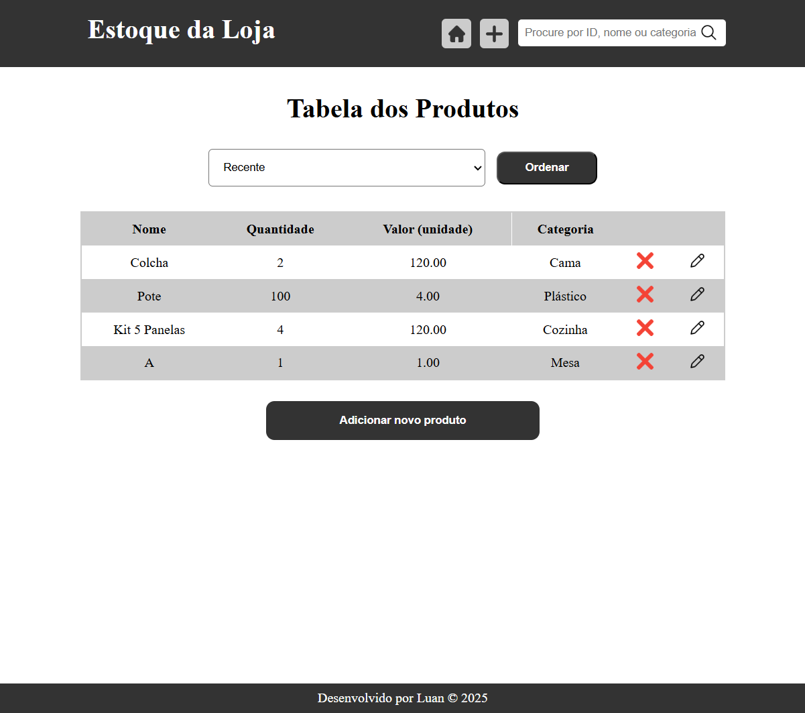

# Estoque da Loja




## Sobre 📝
Projeto full-stack feito para facilitar a contagem de produtos do estoque de uma loja de cama, mesa, banho e plásticos. Aqui você pode ver os produtos, adicionar um novo, excluir e editar.

### Frontend
- Construído com a tecnologia Jinja embutida ao Flask

### Backend
- API contruída puramente com o framework Flask e para o banco de dados foi usado o framework mysql-connector para ligar ao servidor MySQL.

## Instalação 🚀
```bash
# Clonando repositório
$ git clone https://github.com/lnr273/estoque-da-loja.git

# Instalando dependências
$ pip install -r dependencies.txt 
```

- ### Importar Database
1. No prompt de comando do seu OS, acesse a pasta dos executáveis do MySQL
```
$ cd C:\Program Files\MySQL\MySQL Server 8.0\bin
```
2. Conecte ao banco de dados e insira a senha
```
$ mysql -r {user} -p
```
3. Crie um novo schema
```
$ create schema {schema_novo};
```
4. Em outro prompt de comando, acesse novamente a pasta bin do MySQL e rode:
```
$ mysql -u {user} -p {novo_schema_criado} < {caminho_para_dump_do_repositório.sql}
```

## Rodando 🤖
Crie um arquivo `.env` e defina todas as variáveis globais como no exemplo dado em [.env.example](.env.example)

No terminal do IDLE, rode:
```
python app.py
```
O site estará acessível em: [http://localhost:5000/](http://localhost:5000/) 

## Rotas 🛣️
A API concede os seguintes endpoint:
```
GET / Página inicial com tabela dos produtos do banco de dados

GET /add Página para formulário de adição de produto

GET /edit Página para formulário de edição de produto

GET /delete Remove produto do banco de dados com parâmetro da url

GET /search Pesquisa produtos do banco de dados por id, nome e categoria

POST /add Adiciona os valores do formulário ao banco de dados

POST /edit Atualiza os valores do banco de dados para os novos vindos do formulário
```

## Próximos passos
- Adicionar página com mais detalhes sobre o produto, como foto e descrição detalhada.
- Controle de estoque: movimentação dos produtos, notificar produtos com baixa quantidade.